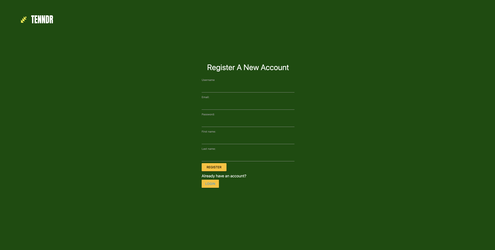
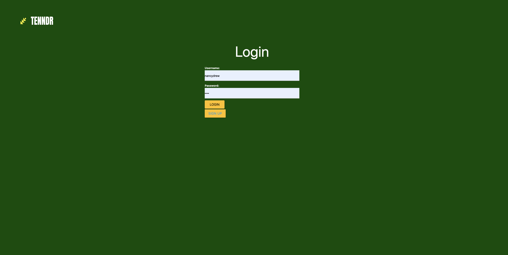
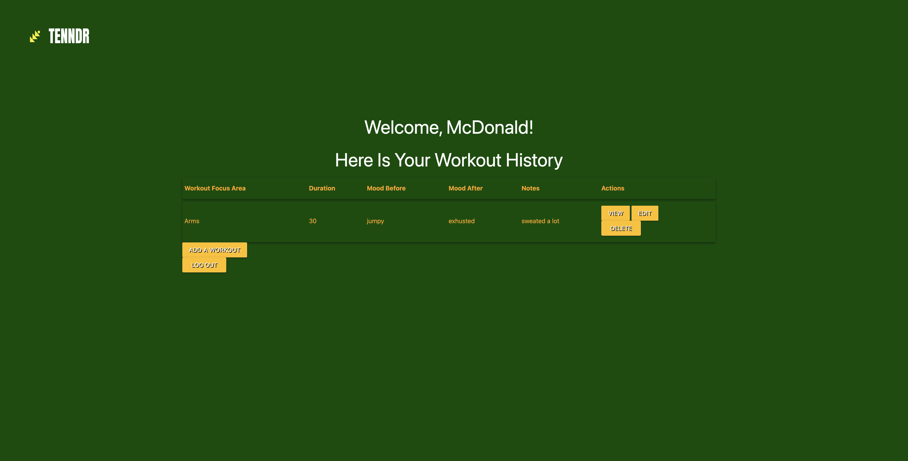
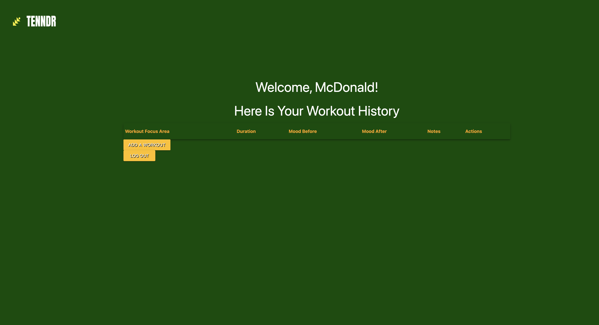

# README
##Tenndr: A Tracker for Selfcare

**About the project**
Tennder is an app that will help its users track a handful of postive habits that will help drive awareness of progress toward thier goals.  
The project is planned to be built out in tiers starting with Fitness and mood tracking and prompted journaling after product market fit expaning to other modules like sleep tracking, meditation and goals around time spent working vs with self and family. 
----
**MVP Product Images**
*Main Landing Page*

*Sign Up*

*Login* 

*Dashboard*

*New Entry*

*Edit Entry*

*Indivdual Entry*

*Delete*

----

**Technologies Used:**
Javascript, CSS, EJS, Express, Node.js, Mongodb
----
**Getting Started:**
Just a few simple steps to get going:
Create an account
Log in
Begin tracking your workouts. 
----
**Roadmap**

New Modules will be Mood Tracking and Journaling schemas
An introdcution of an API offering daily writing prompts and affirmations.
Incorporation of a workout API to deliver fitness plans and suggested workout
A Sleep tracking component. 
Additional features post prodcut market fit would include challenges, team tracking and reward components for gamification of the product.

Specific User Stories can be found in the github project page.

Previous respository and commits can be found at 
https://github.com/theonlykmac200/tenndr

code graveyard includes snippets of code that I depreciated throughout the project build the build and testing, that provides a path a things I've already tried when working through issues.

![ERD]](public/img/ERD.png)
