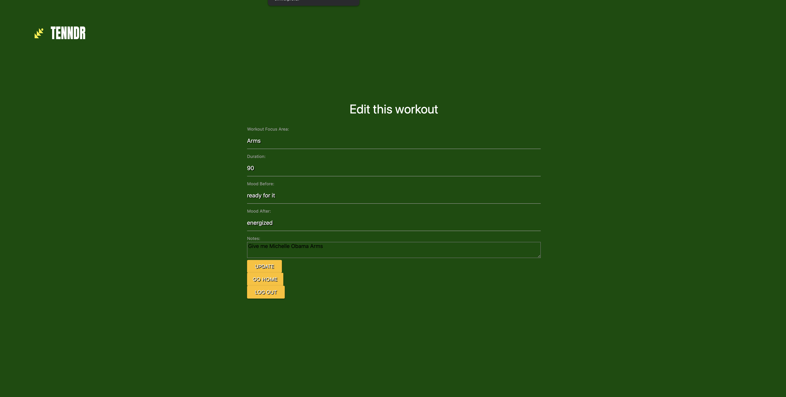

# README
#Tenndr: A Tracker for Selfcare

**About the project**
Tennder is an app that will help its users track a handful of postive habits that will help drive awareness of progress toward thier goals.  
The project is planned to be built out in tiers starting with Fitness and mood tracking and prompted journaling after product market fit expaning to other modules like sleep tracking, meditation and goals around time spent working vs with self and family. 

**MVP Product Images**
*Main Landing Page*

*Sign Up*

*Login* 

*Dashboard*

*New Entry*

*Edit Entry*

*Indivdual Entry*

*Delete*

